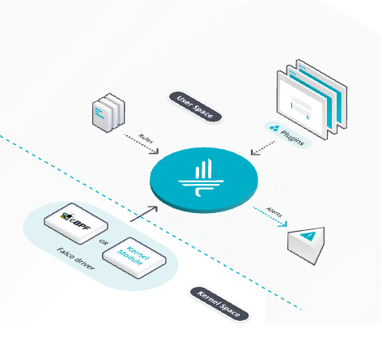
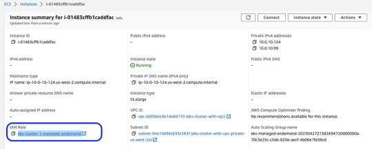

## Table of Content
1. [Overview](#overview)
    - [Cost](#cost)
2. [Prerequisites](#prerequisites)
    - [Operating System](#operating-system)
3. [Deployment Steps](#deployment)
4. [Deployment Validation](#deployment-validation)
5. [Running the Guidance](#running-the-guidance)
6. [Cleanup](#cleanup)

## Overview

Container Runtime Security Monitoring on Amazon Elastic Kubernetes Service (EKS) with CNCF Falco and AWS Security Hub
Customers want a single and comprehensive view of the security posture of their cloud native workloads. Runtime security event monitoring is important to
running secure, operationally excellent, and reliable workloads,especially in environments that run containers and container
orchestration platforms. In this guidance, we show you how to useservices such as [AWS Security
Hub](https://aws.amazon.com/security-hub/) and [Falco](https://falco.org/),a [Cloud Native Computing Foundation](https://www.cncf.io/) project, to build a continuous container runtime security monitoring solution.

With this solution in place, you can collect runtime security findingsfrom multiple AWS regions running one or more containerized workloads on
AWS container orchestration platforms, such as [Amazon ElasticKubernetes Service (Amazon EKS)](https://aws.amazon.com/eks/) . The solution collates container run-time security findings across thoseregions into a designated account where you can have a unified view ofSecurity posture across regions and container workloads.

### Features and benefits

* Amazon Security Hub collects security findings from other AWS services using a standardized AWS Security Findings Format (ASFF). 
* CNCF Falco provides the ability to detect security events at runtime for containers and send them via integrations to external Log management systems Security Hub provides a custom integrations feature using ASFF to enable collection and aggregation of findings that are generated by custom security products.
* This guidance uses integration with Amazon FireLens/FluentBit with Amazon CloudWatch Logs and Lambda to enrich security events logs received from Falco, process them into ASFF format and import into Security Hub.
*  Using Security Hub cross-region configurable aggregation, it is possible to ingest and aggregate security events from multiple Amazon EKS platform deployments in various regions thus providing Security and DevOps teams with a "single pane of glass" Security management portal that contains security incidents from all those platforms and allows for ITIL style automation of remediation.


### Use cases

* Consolidate all of customers' Container security events from multiple application platforms in one place for continuous log retention for security, compliance and audit purposes.
* Format security events into AWS Standard format (ASFF) and import them into central security events monitoring and management portal (Security Hub).
* Aggregate security events from multiple Container application platforms possibly deployed in different AWS regions into "Single pane of glass" portal for Security, DevOps and other teams to efficiently detect container Security threats and collaborate on their triage & resolution.
* Provide security mitigation workflow options to remediate certain Security incidents with AWS services

### Solution overview

Amazon Security Hub collects security findings from other AWS services using a standardized [AWS Security Findings Format
(ASFF)](https://docs.aws.amazon.com/securityhub/latest/userguide/securityhub-findings-format.html). Falco provides
the ability to detect security events at runtime forcontainers. [Partner
integrations](https://aws.amazon.com/security-hub/partners/) likeFalco are also available on Security Hub and use ASFF. Security Hub
provides a custom integrations feature using ASFF to enable collectionand aggregation of findings that are generated by custom security
products.

The solution in this guidance uses [AWS FireLens](https://docs.aws.amazon.com/AmazonECS/latest/developerguide/using_firelens.html), [Amazon
CloudWatch Logs](http://aws.amazon.com/cloudwatch), and [AWSLambda](http://aws.amazon.com/lambda) to enrich logs from Falco and
populate Security Hub.

<!-- 
 <br/>
Figure 2: Architecture diagram of CNCF Falco continuous runtime security monitoring components in Kubernetes cluster

Falco provides streaming detection of unexpected behavior, configuration
changes, and attacks.

-   Uses [eBPF](https://ebpf.io/what-is-ebpf/) to monitor system activity for adverse behavior.

-   Integrates with Kubernetes, so you can protect your containers  infrastructure at scale.

-   Runtime protection is a fundamental layer of defense against  security blind spots and zero-day bugs in your software supply
    chain.

-   Streaming approach enables real-time response while minimizing storage costs and complexity.

-   Ready out-of-the-box with rules, which you can customize for you  environment.

Here’s how the guidance works, per Reference architecture 

1.  An AWS account is used for running container workloads in Amazon EKS
    on Region 1.

    -  Runtime security events detected by Falco for that workload are sent to CloudWatch logs using AWS FireLens/Fluentbit integration.

    -  CloudWatch logs act as the source for FireLens and a trigger for the Lambda function in the next step.

    -  The Lambda function transforms the logs into the ASFF. Thes findings can now be imported into Security Hub.

    -  The Security Hub instance that is running in the same region as the workload running on Amazon EKS ingests and processes the
        findings provided by Lambda to present security posture to users of the account. This instance also acts as a member account for Security Hub.

2.  An AWS account (same by default, using different is also possible with additional Security Hub configuration) is used for running
    container workloads on Amazon EKS on Region 2.

    -  Runtime security events detected by Falco for that workload are sent to CloudWatch logs using AWS FireLens/Fluentbit
        integration.

    -  CloudWatch logs acts as the source for FireLens and a trigger for the Lambda function in the next step.

    -  The Lambda function transforms the logs into the ASFF. These findings can now be imported into Security Hub.

    -  The Security Hub instance that is running in the same region as the workload running on Amazon EKS ingests and processes the findings provided by Lambda and provides the security posture to users of the account. This instance also acts as another member account for Security Hub.

3.  If your workloads span multiple regions, Security Hub supports [aggregating findings across Regions](https://docs.aws.amazon.com/securityhub/latest/userguide/finding-aggregation.html).

The designated Security Hub administrator account (can be the same as one of existing Security instances) combines security findings from member AWS regions/accounts, and provides a comprehensive view of security alerts and security posture across regions/accounts. 

### Prerequisites

For successful deployment, you should have the following in place:

1.  AWS accounts.

 Note: You can use different AWS accounts so you can validate Security Hub’s support for a multi-account setup. However, for a simpler
 configuration, you can use a single AWS account instead to deploy the Amazon EKS workloads in different regions, and send findings to
 regional instances of Security Hubs in the same account. If you are integrated with AWS Organizations, the designated Security Hub
 administrator account [will automatically have access to the member accounts](https://docs.aws.amazon.com/securityhub/latest/userguide/securityhub-accounts.html).

2.  Amazon EKS cluster(s) deployed in AWS region

 **NOTE: Below is the Note for Technical Publishing team in *italics* – need to decide how to reference Related Content from Implementation Guide**

3. Security Hub instance set up with an Administrator account in AWS region.

4. Security Hub instances set up in multiple regions to ingest and  rocess security events from Amazon EKS clusters with workloads. For instructions on how to automatically deploy Amazon EKS cluster with  arious add-ons please see Example and Documentation in the “Related Content” (see above **NOTE** )

5.  CNCF Falco set up on the Amazon EKS clusters, with logs routing to CloudWatch Logs using FireLens. For instructions on deployment,
    please see [below](#deployment-walkthrough):

6.  AWS Cloud Development Kit (CDK) CLI [installed](https://docs.aws.amazon.com/cdk/latest/guide/getting_started.html#getting_started_install) on
    the member accounts to deploy the solution that provides the custom integration between Falco and Security Hub.

## Architecture overview

This section provides an architecture diagram and describes the components deployed with this Guidance.


*Figure 1. Reference architecture of Container Runtime Security Monitoring on Amazon Elastic Kubernetes Service (EKS)*

### Architecture steps

1. FluentBit /[AWS FireLens](https://docs.aws.amazon.com/AmazonECS/latest/developerguide/using_firelens.html) log event aggregation and [Cloud Native Computing Foundations (CNCF) Falco](https://www.cncf.io/projects/falco/) security monitoring components are deployed into [Amazon Elastic Kubernetes Service (EKS)](https://aws.amazon.com/eks) Clusters, running in same or different regions
2. CNCF Falco components monitor application containers running on EKS cluster nodes for possible security incidents (based on defined rules) at run time and  generate security events.
3. Security events are streamed to FluentBit/AWS FireLens log event aggregators running on EKS as well.
4. Aggregated security events are imported into [AWS Cloud Watch](https://aws.amazon.com/cloudwatch/) log streams, specified log groups 
5. AWS Lambda function get triggered by security events in CloudWatch log stream, detect and transform security event data into [Amazon Security Findings Format (ASFF)](https://docs.aws.amazon.com/securityhub/latest/userguide/securityhub-findings-format.html) schema and import into regional [Amazon Security Hub](https://aws.amazon.com/security-hub/) instances
6. Security findings in ASFF format are available in regional Security Hub portals for acknowledgement and triage by regional teams.
7. Regional Security findings aggregated  into ”single pane of glass” central Security Hub portal that includes regional SecurityHub as members (can be one of the regional Hub instances) 
8. Security team users authenticate into the ”single pane of glass” central SecurityHub portal via [Amazon Identity and Access Management (IAM)](https://aws.amazon.com/iam/) , access is granted according to their IAM Roles
9. Aggregated security findings are available in the ”single pane of glass” central SecurityHub portal for acknowledgement and triage using workflows. 

### AWS Services used  in this Guidance

| **AWS service**  | Description |
|-----------|------------|
|[Amazon Elastic Kubernetes Service - EKS](https://aws.amazon.com/eks/)|Core service -  EKS service is used to run the secured container workloads|
|[Amazon Virtual Private Cloud - VPC](https://aws.amazon.com/vpc/)| Core Service - Network security layer |
|[Amazon Elastic Compute Cloud - EC2](https://aws.amazon.com/ec2/)| Core Service - EC2 instance power On Demand and Spot based EKS compute node groups for running container workloads|
|[Amazon Elastic Container Registry - ECR](https://aws.amazon.com/ecr/)|Core service - ECR registry is used to host application container images|
|[Amazon CloudWatch](https://aws.amazon.com/cloudwatch/)|Core service - stores Falco generated log events  |
|[Amazon Identity and Access Manager - IAM](https://aws.amazon.com/iam/))|Auxiliary service - provides user credentials and role mgmt  |

## Prerequisites

### Cost 

You are responsible for the cost of the AWS services used while running this Guidance. As of February 2024, the estimated cost for running this Guidance with the default two-node Amazon EKS cluster in the US East (N. Virginia) Region is approximately **\$0.64 an hour** or **\$467.76 per month**. Refer to the AWS pricing [webpage](https://aws.amazon.com/pricing/?aws-products-pricing) for each AWS service used in this Guidance.

### Sample Cost table

The following table provides a sample cost breakdown for deploying this Guidance with the default parameters in the US East (N. Virginia) Region
for one month.

| **AWS service**  | Rate | Cost \[USD\] |
|-----------|------------|------------|
| Amazon EKS cluster (no compute) |  \$0.10 per hour per cluster X 1 | \$73.00 |
| Amazon EC2 (On-Demand) | \$0.1632 per hour X 1 m7g.xlarge instance | \$119.14|
| Elastic Load Balancing | \$0.0225 Application Load Balancer per hour X 2 ALBs | \$32.85 |
| Elastic Load Balancing | \$0.008 Load Balancer Capacity Units (LCU) per hour X 2 ALBs | \$11.68 |
| VPC Endpoint | \$0.01 per hour per VPC endpoint per Availability Zone (AZ) X 5 endpoints (Amazon S3, Amazon Athena, Amazon ECR, AWS KMS, and Amazon CloudWatch) X 2 AZs | \$73.00 |
| VPC Endpoint | \$0.01 per GB data processed per month X 10 GB | \$0.1 |
|**Total estimated cost per month:**| | **\$XXX.YY** |

 For more information on Spot Instances pricing, refer to the [Amazon EC2 Spot Instances Pricing page](https://aws.amazon.com/ec2/spot/pricing)

### Security

See [CONTRIBUTING](CONTRIBUTING.md#security-issue-notifications) for more information.

## Deployment

The project deploys a Lambda function, that enables receiving Falco security findings from AWS CloudWatch logs, formatting them in ASFF JSON format and integrating into Security Hub

The `cdk.json` file instructs the CDK Toolkit how to execute your application. It was updated for CDK 2.0 per document: https://docs.aws.amazon.com/cdk/v2/guide/migrating-v2.html.

This project is set up like a standard Python project.  The initialization process also creates a virtualenv within this project, stored under the `.venv` directory.  To create the virtualenv it assumes that there is a `python3` (or `python` for Windows) executable in your path with access to the `venv` package. If for any reason the automatic creation of the virtualenv fails, you can create the virtualenv manually.

To manually create a virtualenv on MacOS and Linux:

```bash
python3 -m venv .venv
```

After the init process completes and the virtualenv is created, you can use the following
steps to activate your virtualenv:

```bash
source .venv/bin/activate
```

If you are running the sample on a Windows platform, you would activate the virtualenv like this:

```bash
% .venv\Scripts\activate.bat
```

Once the virtualenv is activated, you can install the required dependencies.

```bash
python -m pip install -r requirements.txt
```

At this point you can now synthesize the CloudFormation template for this code.

```bash
cdk synth
```

To add additional dependencies, for example other CDK libraries, just add them to the `setup.py` file and rerun the `python -m pip install -r requirements.txt` command (or `pip install -r requirements.txt` from pip command prompt).

You may need to bootstrap your Account/region to CDK using command like:
```bash
cdk bootstrap aws://<account ID/us-west-2
......
[WARNING] @aws-cdk/aws-lambda.Code#asset is deprecated.
  use `fromAsset`
  This API will be removed in the next major release.
 ⏳  Bootstrapping environment aws://<account ID/us-west-2...
Trusted accounts for deployment: (none)
Trusted accounts for lookup: (none)
Using default execution policy of 'arn:aws:iam::aws:policy/AdministratorAccess'. Pass '--cloudformation-execution-policies' to customize.
CDKToolkit: creating CloudFormation changeset...
 ✅  Environment aws://<account ID/us-west-2 bootstrapped.
```
Then initialize deployment of artifacts into target Account/Region environment:

```
cdk deploy
...
[WARNING] @aws-cdk/aws-lambda.Code#asset is deprecated.
  use `fromAsset`
  This API will be removed in the next major release.

✨  Synthesis time: 1.03s

This deployment will make potentially sensitive changes according to your current security approval level (--require-approval broadening).
Please confirm you intend to make the following modifications:

IAM Statement Changes
┌───┬───────────────────┬────────┬─────────────────────────────────┬──────────────────────────────┬───────────┐
│   │ Resource          │ Effect │ Action                          │ Principal                    │ Condition │
├───┼───────────────────┼────────┼─────────────────────────────────┼──────────────────────────────┼───────────┤
│ + │ ${CustomRole.Arn} │ Allow  │ sts:AssumeRole                  │ Service:lambda.amazonaws.com │           │
├───┼───────────────────┼────────┼─────────────────────────────────┼──────────────────────────────┼───────────┤
│ + │ *                 │ Allow  │ ec2:DescribeInstances           │ AWS:${CustomRole}            │           │
│ + │ *                 │ Allow  │ ecs:DescribeTasks               │ AWS:${CustomRole}            │           │
│ + │ *                 │ Allow  │ securityhub:BatchImportFindings │ AWS:${CustomRole}            │           │
└───┴───────────────────┴────────┴─────────────────────────────────┴──────────────────────────────┴───────────┘
IAM Policy Changes
┌───┬───────────────┬────────────────────────────────────────────────────────────────────────────────┐
│   │ Resource      │ Managed Policy ARN                                                             │
├───┼───────────────┼────────────────────────────────────────────────────────────────────────────────┤
│ + │ ${CustomRole} │ arn:${AWS::Partition}:iam::aws:policy/service-role/AWSLambdaBasicExecutionRole │
└───┴───────────────┴────────────────────────────────────────────────────────────────────────────────┘
(NOTE: There may be security-related changes not in this list. See https://github.com/aws/aws-cdk/issues/1299)

Do you wish to deploy these changes (y/n)? y
AwsSecurityhubFalcoEksIntegrationStack: deploying... [1/1]
[0%] start: Building and publishing 23af06be3d08822fbfabb7584213fde595fd9086a8cce59bf34f1eaa43bd30ae:current
[100%] success: Built and published 23af06be3d08822fbfabb7584213fde595fd9086a8cce59bf34f1eaa43bd30ae:current
AwsSecurityhubFalcoEksIntegrationStack: creating CloudFormation changeset...

 ✅  AwsSecurityhubFalcoEksIntegrationStack

✨  Deployment time: 54.51s

Stack ARN:
arn:aws:cloudformation:us-west-2:133776528597:stack/AwsSecurityhubFalcoEksIntegrationStack/0630f0c0-961e-11ee-8bf5-06e93086ece7
✨  Total time: 55.54s
```
The message above should confirm successful deployment of AwsSecurityhubFalcoEksIntegrationStack components

## Useful CDK commands

 * `cdk ls`          list all stacks in the app
 * `cdk synth`       emits the synthesized CloudFormation template
 * `cdk deploy`      deploy this stack to your default AWS account/region
 * `cdk diff`        compare deployed stack with current state
 * `cdk docs`        open CDK documentation

### Deployment Walkthrough

#### Set up a Falco Runtime Security

NOTE: This Guidance specifically uses integration of Falco with Amazon [FireLens](https://docs.aws.amazon.com/AmazonECS/latest/developerguide/using_firelens.html)
and Amazon CloudWatch to send and collect security events. There is an option to use the companion OSS component called
[Falcosidekick](https://github.com/falcosecurity/falcosidekick) to send the security events to Amazon CloudWatch directly, it is not covered by
this Guidance.

-   Falco continuously scans the containers running in the pods and sends the security, debug, or audit events as JSON format as STDOUT.

-   FireLens then collects the JSON log file and processes/parses the  log files as per Fluent Bit configuration files.

-   After log transformation by Fluent Bit containers, the logs are
    finally sent to AWS CloudWatch as the final destination.


### Clone the project repository

Git clone this repository to your deployment environment: 
```bash
git clone https://github.com/aws-solutions-library-samples/guidance-for-container-runtime-security-monitoring-on-amazon-eks-with-cncf-falco-amazon-securityhub
```
Navigate to directory `fluent-bit` - you will find two directorie called `aws` and `kubernetes`

`aws` – this is the directory that has the IAM policy called iam_role_policy.json, which you will attach to the compute node
IAM role which is automatically attached to the compute nodes when deploy an EKS cluster. This policy will give Falco running on the EKS
compute nodes ability to send/stream logs to Amazon CloudWatch.

`kubernetes` – this directory has three files: configmap.yaml, daemonset.yaml, and service-account.yaml. These files will be applied to
create a ConfigMap for Fluent Bit configuration, DaemonSet to run pods on all compute nodes, and finally a Service Account for the RBAC cluster
role for authorization. All the files can be applied all at once or one by one using `kubectl apply` command

#### Set up IAM Permissions for Falco

Run the following command in order to create an IAM policy 
```bash
aws iam create-policy --policy-name EKS-CloudWatchLogs --policy-document file://./fluent-bit/aws/iam_role_policy.json
```
This creates a policy called *EKS-CloudWatchLogs* with privileges to
send logs to Amazon CloudWatch.

```bash
aws iam attach-role-policy --role-name <EKS-NODE-ROLE-NAME> --policy-arn `aws iam list-policies | jq -r '.[][] | select(.PolicyName == "EKS-CloudWatchLogs") | .Arn'`
```
  
NOTE: “EKS-NODE-ROLE-NAME” is the role that is attached to the EKS compute nodes. You can find the role attached by checking any of EC2
node instances. For example, in the example below ‘eks-cluster-1-managed-ondemand’ is the role attached the node:

<!-- img src="media/image3.png" style="width:7.5in;height:3.00694in" / -->
 <br/>

Figure 3. IAM Role attached to EC2 instance of EKS Compute node

Below is an example of the command to attach needed policies to EKS node
role above:
```bash
aws iam attach-role-policy --role-name eks-cluster-1-managed-ondemand --policy-arn \`aws iam list-policies | jq -r '.\[\]\[\] |
select(.PolicyName == "EKS-CloudWatchLogs") | .Arn'\`
```
#### Set up Fluentbit/Amazon FireLens Log Aggregation on EKS Cluster

To preview and update, if necessary, the configuration of Fluentbit/FireLens components, navigate to the `fluent-bit/kubernetes`
directory and review the configuration files (fluentbit-config-crio.yaml, daemonset.yaml and service-account.yaml) that will be applied.

NOTE: you can specify the target AWS region, CloudWatch log group and log stream names by adjusting the following parameters in the file:
[Fluentbit-config-crio.yaml](https://github.com/aws-solutions-library-samples/guidance-for-container-runtime-security-monitoring-on-amazon-eks-with-cncf-falco-amazon-securityhub/blob/main/fluent-bit/kubernetes/fluent-bit-config-crio.yaml)
```yaml
…

[OUTPUT]

Name cloudwatch
Match falco.\*\*
region us-west-2
log_group_name falco
log_stream_name alerts-eks
auto_create_group true
…
```

To apply Fluentbit/FireLens configuration, run the following command from the guidance root directory:

```bash
# first, create a namespace for Falco related components if it doesn’t exist yet kubectl create ns falco
kubectl create ns falco

# Deploy Fluentbit - FireLens integration
kubectl apply -f fluent-bit/kubernetes/ -n falco
```

It should generate an output like shown below confirming that all K8s objects are created in the target namespace:
```bash
configmap/Fluentbit-config created
daemonset.apps/fluentbit created
configmap/Fluentbit-config configured
serviceaccount/Fluentbit created
clusterrole.rbac.authorization.k8s.io/pod-log-reader created
clusterrolebinding.rbac.authorization.k8s.io/pod-log-crb created
```
That completes installation/configuration of FireLens/FluentBit integration

#### Falco Helm Template Configuration Update and Installation

Clone the [falcosecurity/falco](https://github.com/falcosecurity/charts) public Helm chart repository as below and add the Helm chart to the list of known repositories.

```bash
git clone https://github.com/falcosecurity/charts.git;
helm repo add falcosecurity https://falcosecurity.github.io/charts
helm repo update
```

Falco behavior can be controlled by a [configuration parameters](https://github.com/falcosecurity/charts/tree/master/falco#introduction),
which can be supplied as runtime parameters while installing the chart or by creating a special purpose file, for example **values.yaml** (you
can give any name). Please reference this [page](https://github.com/falcosecurity/charts/tree/master/falco#introduction) to
understand all Falco chart configuration parameters, which control the run time behavior of Falco audit level, log level, output formats etc.

NOTE: The jsonOutput property is false in the Falco chart parameter file `values.yaml` by default. Set to true for JSON formatted output via
Fluentbit as well as related properties. This guidance is not covering customization of Falco audit rules, which is a whole different important aspect of adopting this highly configurable solution.
```bash
# -- If "true", print falco alert messages and rules file
# loading/validation results as json, which allows for easier
# consumption by downstream programs. Default is "false".
json_output: true

# -- When using json output, whether or not to include the "output" property
# itself (e.g. "File below a known binary directory opened for writing
# (user=root ....") in the json output.
json_include_output_property: true

# -- When using json output, whether or not to include the "tags" property

# itself in the json output. If set to true, outputs caused by rules
# with no tags will have a "tags" field set to an empty array. If set to
# false, the "tags" field will not be included in the json output at all.
json_include_tags_property: true
```

Please refer to the sample of
[values.yaml ](https://github.com/aws-solutions-library-samples/guidance-for-container-runtime-security-monitoring-on-amazon-eks-with-cncf-falco-amazon-securityhub/blob/main/falco-helm-chart/values_customize_sample.yaml) with customizations above is included into sample code repository for your reference.

Please note where Falco rules configuration files will be deployed in pods, also specified as parameters in the
[values.yaml](https://github.com/aws-solutions-library-samples/guidance-for-container-runtime-security-monitoring-on-amazon-eks-with-cncf-falco-amazon-securityhub/blob/main/falco-helm-chart/values_customize_sample.yaml) file above:

```bash
..
# The files will be read in the order presented here, so make sure if
# you have overrides they appear in later files.
# -- The location of the rules files that will be consumed by Falco.

rules_file:

- /etc/falco/falco_rules.yaml
- /etc/falco/falco_rules.local.yaml
- /etc/falco/rules.d
…
```

After performing that (and other optional customizations, e.g., enabling Falcosidekick - outside of this Guidance scope) install the Helm chart running the following command:
```bash
helm install falco -f <path-to-/values.yaml> falcosecurity/falco -n falco

#for example if cloned Falco Helm chart repository is in `./charts/charts/falco` location:
helm install falco -f ./charts/charts/falco/values.yaml falcosecurity/falco -n falco 
```
You should see an output similar to the following:
```bash
NAME: falco

LAST DEPLOYED: Thu May 11 12:02:40 2023

NAMESPACE: falco

STATUS: deployed

REVISION: 1

NOTES:

Falco agents are spinning up on each node in your cluster. After a few seconds, they are going to start monitoring your containers looking for security issues.
```

**NOTE: No further action should be required.** 

Once this deployment is completed, Falco will be monitoring your Kubernetes cluster pods for
security or suspicious events behavior (configured in Falco rules) an sending the log events to FireLens, which transforms the JSON logs as
per the configuration settings specified and finally sends the logs to CloudWatch.

At the end, you should have the following pods and deployments related to Falco:
```bash
kubectl -n falco get pods
```
You should see the following output:
```bash
NAME READY STATUS RESTARTS AGE
NAME              READY   STATUS    RESTARTS   AGE
falco-7lvsz       2/2     Running   0          3m1s
falco-pvnkk       2/2     Running   0          3m1s
falco-vdvc8       2/2     Running   0          3m1s
fluentbit-f9hft   1/1     Running   0          16m
fluentbit-hdrj4   1/1     Running   0          16m
fluentbit-wqtv9   1/1     Running   0          16m
```

As you can see, both Fluentbit/FireLens and Falco pods are up and running in the specified EKS namespace `falco`

(Optional) To check that settings specified in *values.yaml* file are correctly set in the Falco pods, you can connect to one of the pods
(total number should be equal to number of EKS nodes) using the following command:
```bash
kubectl -n falco exec -it <falco-pod-name> -- /bin/bash
```
Once inside Falco pod, navigate to its deployment directory `/etc/falco` and verify that `falco.yaml` file has `json_output settings` as specified above:
```bash
# ls /etc/falco
falco.yaml falco_rules.yaml
# cat /etc/falco/falco.yaml | grep json

json_include_output_property: true
json_include_tags_property: true
json_output: true
library_path: libjson.so
name: json
```

#### Deploy Integration with SecurityHub

In this section, you will learn how to deploy the solution and enable the CloudWatch Logs group as an event trigger source. Enabling the
CloudWatch Logs group is the trigger for running the Lambda function in AWS accounts.

To deploy the sample code into your AWS account:

1.  Follow the instructions above to build and deploy AWS Integration components via AWS CDK. Make sure that you deploy the solution to the region(s) hosting your Amazon EKS clusters.

2.  Navigate to the [AWS Lambda Console ](https://console.aws.amazon.com/lambda)and confirm that you see the newly created Lambda function. You will use this function in the next section.

<!--img src="media/image4.png" style="width:7.5in;height:0.34861in" /

*Figure 4: Imported Lambda function for Falco events integration with
Security Hub*

Enable Trigger from the CloudWatch Logs group

1.  In the AWS Management Console, select the Lambda function shown in
    Figure 4—AwsSecurityhubFalcoEcsEksln-lambdafunction—and then, on
    the Function overview screen, select *+ Add trigger*.

2.  On the ‘Add trigger’ screen, provide the following information and
    then select Add, as shown in Figure 3.

    -   Trigger configuration – From the drop-down, select ‘CloudWatch logs’.

    -   Log group – Choose the Log group you noted in Step 4 of the [Prerequisites](#prerequisites). In our setup, the
        log group for Amazon EKS clusters, deployed in separate AWS accounts, was set with the same value (falco).

    -   Filter name – Provide a name for the filter, for example falco-events-trigger.

    -   Filter pattern – *optional* – Leave this field blank.

 <img src="media/image5.png" style="width:6.0563in;height:4.92618in" /

 Figure 5: Configuration of Lambda function trigger for CloudWatch Log group

1.  Repeat these steps (as applicable) to set up triggers for the Lambda functions deployed in other regions where EKS clusters and
    SecurutyHub instances are provisioned.


### Deployment Validation

Now that you’ve deployed the solution, you will verify that it’s working.

With the [default
rules](https://github.com/falcosecurity/rules/blob/3ceea88eeb6710e2c3d2726805a4ff0e93862de9/rules/falco_rules.yaml),
Falco generates alerts for “suspicious” activities such as:

-   An attempt to write to a file below the /etc folder in a container.
    The /etc folder contains important system configuration files.

-   An attempt to open a sensitive file (such as /etc/shadow) for
    reading.

To test your Falco deployment, you can manually perform such activities
to generate Falco alerts that are reported as Security Hub findings in
the same account. Then you will review the findings.

### Test Deployment in AWS Region 1

1.  Run the following commands to simulate hacker attack which should
    trigger an alert in AWS Region 1, which is running an Amazon EKS
    cluster. Replace *&lt;pod_name&gt; *with your own value for test
    pod name
```bash
kubectl -n &lt;namespace&gt; exec -it &lt;pod_name&gt; -- /bin/bash
touch /etc/1
touch /etc/2
touch /etc/3
cat /etc/shadow &gt; /dev/null
```

2.  (Optional) To see the log generated by Falco security event pushed to CloudWatch via Amazon Fluentbit/FireLens integration, you can
    take a look in the ‘*falco’* Log Group, ‘*alerts_eks’* folder contents and review Log entries generated after simulation of container hacking:

<img src="media/image6.png" style="width:7.71969in;height:1.54651in" /

<img src="media/image7.png" style="width:7.80582in;height:2.01192in" /

 Figure 4: CloudWatch Log entries from CNCF Falco processed by Fluentbit/FireLens

3.  (Optional) To see the log generated by Lambda function that handles
    new security events appearing in the CloudWatch logs above, you can
    navigate to the
    */aws/lambda/AwsSecurityhubFalcoEcsEksIn-lambdafunction*-XXXXX Log
    Group and open one of the entries:

 <img src="media/image8.png" style="width:7.22281in;height:2.7226in" /

 The highlighted debugging message confirms that security event was converted to ASFF format and imported into regional SecurityHub
 instance

4.  To see the list of security findings, log in to your Security Hub with ‘admin’ account and navigate to Findings. As shown in Figure 5,
    you will see the alerts generated by Falco, including the Falco-generated title, and the instance where the alert was
    triggered.

 <img src="media/image9.jpeg" style="width:6.87778in;height:2.62566in" /

 Figure 5: Security Findings in Security Hub originating from Falco

1.  To see more detail of a Security finding, check the box next to the
    finding. The figure below shows some of the details for the ‘Read
    sensitive file by untrusted program’ finding.

 <img src="media/image10.jpg" style="width:4.67778in;height:5.39975in" /

 Figure 6: Sensitive file read security finding – detail view

 In the screenshot below, you can see the Resources details of above finding, that includes the instance ID of the Amazon EKS cluster node.
 In our example, this is the [Amazon Elastic Compute Cloud (Amazon EC2)](http://aws.amazon.com/ec2) instance.

 <img src="media/image11.png" style="width:5.52659in;height:3.87431in" /

 Figure 7: Sensitive file read security finding – Resources detail


#### Review Security findings from all Regions in the aggregated Security Hub

1.  Using designated Security Hub administrator account, authenticate to
    the Security Hub instance that aggregates events/findings from other
    AWS Regions (which may be one of regional instances as well) and
    navigate to ‘Findings’.

 NOTE: when logged in to regional Security Hub instances, there are
 links navigating to the central instance available from member
 instances at the top of the screen like shown below:

 <img src="media/image12.png" style="width:7.30187in;height:0.3198in" /

1.  Navigate to the central (“single pane of glass”) Security Hub
    instance to review security posture across EKS workloads deployed in
    AWS regions - findings from all aggregated regions are collated in
    that view. The figure below shows security findings from different
    Regions:

 <img src="media/image13.png" style="width:7.19066in;height:1.88488in" /

 Figure 8: Aggregated view of security findings in the “single pane of
 glass” Security Hub

1.  To see more information including AWS Region where EKS cluster is
    running, check the box next to the finding. The Figure below shows
    the region and instance details associated with a specific finding
    in member account 1.

 <img src="media/image14.png" style="width:4.67744in;height:5.92263in" /

 Figure 9: Security alert caused by sensitive container file under /etc
 showing AWS region of origin

1.  To change status of a Security finding (e.g., to reflect an actual
    notification of responsible teams for remediations), select one or
    more security findings using filter such as ‘Company name’
    (*AnyCompany* in the example below) etc. and select ‘Workflow
    Status’ option from the drop-down list to update the status of
    security remediation workflow:

 <img src="media/image15.jpeg"
 style="width:6.22222in;height:2.14379in" /

 Figure 10: Changing security issue response workflow status from the
 Security Hub aggregated account

 Now security findings workflow status will show as ‘Notified”
 indicating that the teams were notified of those security events and
 will be taking further remediation actions. Then their status can be
 further updated to ‘Resolved’ or ‘Suppressed’ if security team deems
 that security events don’t constitute an actual threat and can be
 reviewed later:

 <img src="media/image16.jpeg"
 style="width:6.22222in;height:1.42823in" /

 Figure 11: Updated security issues workflow status from the Security
 Hub aggregated account

 NOTE: updating ‘Workflow Status’ of security findings can be also
 performed in regional Security Hub instances by authorized users and
 that status would be reflected in the aggregated Security Hub account
 as well.

 By centralizing and enriching the security findings by CNCF Falco,
 your Security teams can detect security anomalies in containers more
 quickly or perform automated remediation on the impacted resources.

 

### Cleaning up

To clean up this demo:

1.  Delete the CloudWatch Logs trigger from the Lambda functions that
    were created in the section [Enable the CloudWatch Logs
    group](#deploy-integration-with-securityhub).

2.  Delete the Lambda functions by deleting the CloudFormation stack,
    created in the section [Deploy Integration with
    SecurityHub](#deploy-integration-with-securityhub).

3.  Uninstall Falco security components by running the following
    commands to verify and delete Helm chart release:

```bash
helm ls -n falco

NAME NAMESPACE REVISION UPDATED STATUS CHART APP VERSION

**falco** falco 1 2023-05-11 12:02:40.459092 -0700 PDT deployed
falco-3.1.5 0.34.1

helm delete **falco** -n falco  
….

&lt;deletion confirmation message&gt;
```
1.  (Optional, only if no longer needed for other workloads) Delete Amazon EKS cluster(s) created as part of
    the [Prerequisites](#prerequisites).
 
### Support and Troubleshooting

This guidance is an
[Open-Source](https://opensource.com/resources/what-open-source) project maintained by AWS Solution Architects. **It is not part of an AWS
Service and support is provided best-effort by** AWS Solution Architects and the user community.

To post feedback, submit feature ideas or report bugs, you can use
the [Issues section](https://github.com/aws-solutions-library-samples/guidance-for-container-runtime-security-monitoring-on-amazon-eks-with-cncf-falco-amazon-securityhub/issues) of the sample GitHub repository.

If you are interested in contributing to the guidance sample code, you
can follow the [Contribution
guide.](https://github.com/aws-solutions-library-samples/guidance-for-container-runtime-security-monitoring-on-amazon-eks-with-cncf-falco-amazon-securityhub/blob/main/CONTRIBUTING.md)

### Troubleshooting

For troubleshooting AWS components of the Guidance (FireLens/Fluentbit, CloudWatch, Lambda, SecurityHub) please collect operational support
information from the problematic component (CloudWatch and Lambda log files, various metrics and logs from EKS clusters etc.) and review them
for error messages, then contact AWS Support if needed.

Lambda security log event transformation and import function Python code has been verified for Runtime 3.8 running on x86_64 architecture:

<img src="media/image17.png" style="width:7.5in;height:1.49236in" /

Figure 12: Lambda function runtime settings in AWS Console

Setting up “Update runtime version” to Auto should ensure that when Python runtime environment gets deprecated, it would be automatically
updated for this function which should keep it working.

Since CNCF Falco is an Open Source project, for troubleshooting Falco components for please follow the project repository for
[issues](https://github.com/falcosecurity/falco/issues) as well as this Kubernetes Slack [channel](https://kubernetes.slack.com/archives/CMWH3EH32)

## Cleanup 
 In order to unstall the guidance, perform the following commands
 
## License

This library is licensed under the MIT-0 License. See the [LICENSE](LICENSE) file.
## BELOW IS COPY FROM THE WORD CONVERTED IMPLEMENTATION GUIDE

[1](#guidance-for-container-run-time-security-monitoring-on-amazon-eks-with-cncf-falco-and-amazon-securityhub)](#guidance-for-container-run-time-security-monitoring-on-amazon-eks-with-cncf-falco-and-amazon-securityhub)

[Solution overview ](#solution-overview)

[Prerequisites](#prerequisites)

[Deployment Walkthrough (#deployment-walkthrough)](#deployment-walkthrough)

[Set up a Falco Runtime Security](#set-up-a-falco-runtime-security)

[Clone the Falco repository](#clone-the-falco-repository)

[Set up IAM Permissions for Falco](#set-up-iam-permissions-for-falco)

[Set up Fluentbit/Amazon FireLens Log Aggregation on EKS Cluster](#set-up-fluentbitamazon-firelens-log-aggregation-on-eks-cluster)

[Falco Helm Template Configuration Update and Installation](#falco-helm-template-configuration-update-and-installation)

[Deploy Integration with SecurityHub](#deploy-integration-with-securityhub)

[Deployment Validation](#deployment-validation)

[Test Deployment in AWS Region 1](#test-deployment-in-aws-region-1)

[(Optional) Test Deployment in AWS Region 2](#optional-test-deployment-in-aws-region-2)

[Review Security findings from all Regions in the aggregated Security
Hub](#review-security-findings-from-all-regions-in-the-aggregated-security-hub)

[Cleaning Up ](#cleaning-up)

[Support and Troubleshooting](#support-and-troubleshooting)

[Support & Feedback](#support-feedback)

[Troubleshooting](#troubleshooting)

[Conclusion](#conclusion)

## Conclusion

Following this guidance, you learned how to implement multi-region
continuous runtime security monitoring for container-based workloads
running on Amazon EKS clusters. This is achieved by creating a custom
integration between Falco runtime security monitoring, Amazon CloudWatch
and Amazon Security Hub.

You can extend this solution in a number of ways. For example:

-   You can forward findings across AWS regions using a single source to
    security information and event management (SIEM) tools such as
    Splunk.

-   You can perform automated remediation activities based on the
    findings generated, using Lambda.

To learn more about managing a centralized Security Hub administrator
account, see [Managing administrator and member
accounts](https://docs.aws.amazon.com/securityhub/latest/userguide/securityhub-accounts.html).
To learn more about working with ASFF, see [AWS Security Finding
Format
(ASFF)](https://docs.aws.amazon.com/securityhub/latest/userguide/securityhub-findings-format.html) in
the documentation. To learn more about the Falco engine and rule
structure, see the [Falco
documentation](https://falco.org/docs/getting-started/falco-kubernetes-quickstart/).
