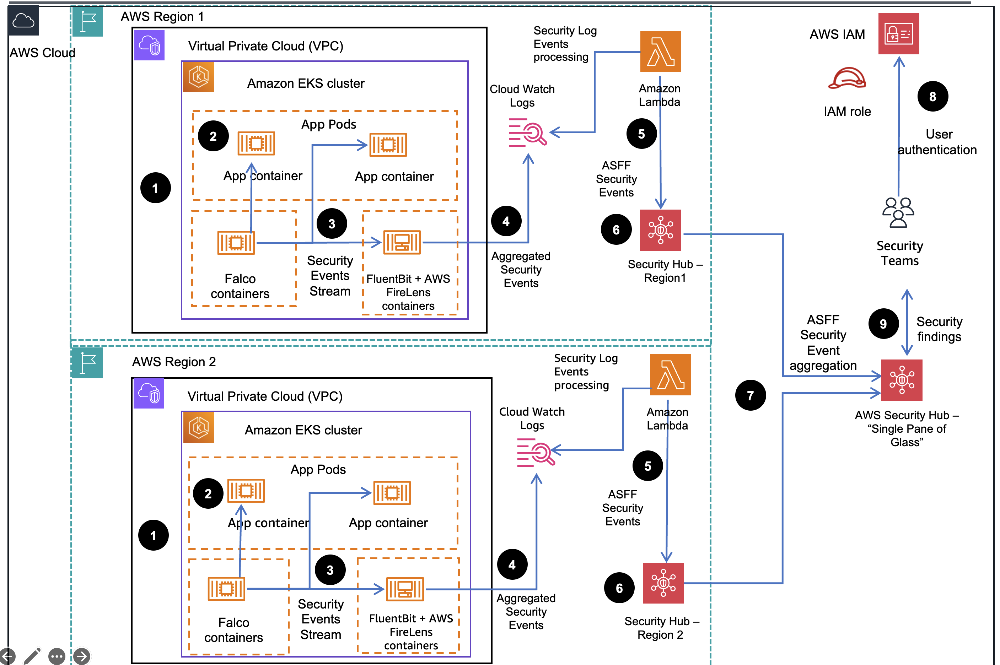

## Table of Content
1. [Overview](#overview)
    - [Cost](#cost)
2. [Prerequisites](#prerequisites)
    - [Operating System](#operating-system)
3. [Deployment Steps](#deployment)
4. [Deployment Validation](#deployment-validation)
5. [Running the Guidance](#running-the-guidance)
6. [Cleanup](#cleanup)

## Overview

Container Runtime Security Monitoring on Amazon Elastic Kubernetes Service (EKS) with CNCF Falco and AWS Security Hub

### Features and benefits

* Amazon Security Hub collects security findings from other AWS services using a standardized AWS Security Findings Format (ASFF). 
* CNCF Falco provides the ability to detect security events at runtime for containers and send them via integrations to external Log management systems Security Hub provides a custom integrations feature using ASFF to enable collection and aggregation of findings that are generated by custom security products.
* This guidance uses integration with Amazon FireLens/FluentBit with Amazon CloudWatch Logs and Lambda to enrich security events logs received from Falco, process them into ASFF format and import into Security Hub.
*  Using Security Hub cross-region configurable aggregation, it is possible to ingest and aggregate security events from multiple Amazon EKS platform deployments in various regions thus providing Security and DevOps teams with a "single pane of glass" Security management portal that contains security incidents from all those platforms and allows for ITIL style automation of remediation.


### Use cases

* Consolidate all of customers' Container security events from multiple application platforms in one place for continuous log retention for security, compliance and audit purposes.
* Format security events into AWS Standard format (ASFF) and import them into central security events monitoring and management portal (Security Hub).
* Aggregate security events from multiple Container application platforms possibly deployed in different AWS regions into "Single pane of glass" portal for Security, DevOps and other teams to efficiently detect container Security threats and collaborate on their triage & resolution.
* Provide security mitigation workflow options to remediate certain Security incidents with AWS services

## Architecture overview

This section provides an architecture diagram and describes the components deployed with this Guidance.



*Figure 1. Reference architecture of Container Runtime Security Monitoring on Amazon Elastic Kubernetes Service (EKS)*

### Architecture steps

1. FluentBit /[AWS FireLens](https://docs.aws.amazon.com/AmazonECS/latest/developerguide/using_firelens.html) log event aggregation and [Cloud Native Computing Foundations (CNCF) Falco](https://www.cncf.io/projects/falco/) security monitoring components are deployed into [Amazon Elastic Kubernetes Service (EKS)](https://aws.amazon.com/eks) Clusters, running in same or different regions
2. CNCF Falco components monitor application containers running on EKS cluster nodes for possible security incidents (based on defined rules) at run time and  generate security events
3. Security events are streamed to FluentBit/AWS FireLens log event aggregators
4. Aggregated security events are imported into [AWS Cloud Watch](https://aws.amazon.com/cloudwatch/) log streams, specified log groups 
5. AWS Lambda functions get triggered by security events in CloudWatch log stream, detect and transform them into [Amazon Security Findings Format (ASFF)](https://docs.aws.amazon.com/securityhub/latest/userguide/securityhub-findings-format.html) schema and import into regional [Amazon Security Hub](https://aws.amazon.com/security-hub/) instances
6. Security findings in ASFF format are available in regional Security Hub portals for acknowledgement and triage by regional teams.
7. "Regional" Security findings aggregated  into ”single pane of glass” central Security Hub portal that includes regional SecurityHub as members (can be one of the regional Hub instances) 
8. Security team users authenticate into the ”single pane of glass” central SecurityHub portal via [Amazon Identity and Access Management (IAM)](https://aws.amazon.com/iam/) , access is granted according to their IAM Roles
9. Aggregated security findings are available in the ”single pane of glass” central SecurityHub portal for acknowledgement and triage using workflows. 

### AWS Services used  in this Guidance

| **AWS service**  | Description |
|-----------|------------|
|[Amazon Elastic Kubernetes Service - EKS](https://aws.amazon.com/eks/)|Core service - The EKS service is used to host the guidance workloads|
|[Amazon Virtual Private Cloud - VPC](https://aws.amazon.com/vpc/)| Core Service - network security layer |
|[Amazon Elastic Compute Cloud - EC2](https://aws.amazon.com/ec2/)| Core Service - EC2 instance power On Demand and Spot based EKS compute node groups for running container workloads|
|[Amazon Elastic Container Registry - ECR](https://aws.amazon.com/ecr/)|Core service - ECR registry is used to host application container images|
|[Amazon CloudWatch](https://aws.amazon.com/cloudwatch/)|Core service - stores Falco generated log events  |
|[Amazon Identity and Access Manager - IAM](https://aws.amazon.com/iam/))|Auxiliary service - provides user credentials and role mgmt  |


## Prerequisites

### Cost 

You are responsible for the cost of the AWS services used while running this Guidance. As of February 2024, the estimated cost for running this Guidance with the default two-node Amazon EKS cluster in the US East (N. Virginia) Region is approximately **\$0.64 an hour** or **\$467.76 per month**. Refer to the AWS pricing [webpage](https://aws.amazon.com/pricing/?aws-products-pricing) for each AWS service used in this Guidance.

### Sample Cost table

The following table provides a sample cost breakdown for deploying this
Guidance with the default parameters in the US East (N. Virginia) Region
for one month.

| **AWS service**  | Rate | Cost \[USD\] |
|-----------|------------|------------|
| Amazon EKS cluster (no compute) |  \$0.10 per hour per cluster X 1 | \$73.00 |
| Amazon EC2 (On-Demand) | \$0.1632 per hour X 1 m7g.xlarge instance | \$119.14|
| Amazon EC2 (Spot) | \$0.1174 per hour X 1 r4.xlarge instance | \$85.70 |
| Amazon EC2 (Graviton Spot) | \$0.0966 per hour X 1 r7g.xlarge instance | \$70.52 | 
| Elastic Load Balancing | \$0.0225 Application Load Balancer per hour X 2 ALBs | \$32.85 |
| Elastic Load Balancing | \$0.008 Load Balancer Capacity Units (LCU) per hour X 2 ALBs | \$11.68 |
| VPC Endpoint | \$0.01 per hour per VPC endpoint per Availability Zone (AZ) X 5 endpoints (Amazon S3, Amazon Athena, Amazon ECR, AWS KMS, and Amazon CloudWatch) X 2 AZs | \$73.00 |
| VPC Endpoint | \$0.01 per GB data processed per month X 10 GB | \$0.1 |
| Amazon S3 (storage) |  \$0.023 per GB for First 50 TB/month X 1 GB | \$0.02 |

|**Total estimated cost per month:**| | **\$XXX.YY** |

Amazon CloudFront cost is not included in the estimation table, as its monthly [Free Tier](https://aws.amazon.com/cloudfront/pricing/) can fully covered the usage. To avoid the instance capacity issue, additional types of r5.xlarge and 5a.xlarge are included in the EC2 Spot Instance fleet, and r6g.xlarge,r6gd.xlarge are included in the Graviton Spot instance fleet. Their pricing varies based on the time period your instances are running. For more information on Spot Instances pricing, refer to the [Amazon EC2 Spot Instances Pricing page](https://aws.amazon.com/ec2/spot/pricing)

### Security

See [CONTRIBUTING](CONTRIBUTING.md#security-issue-notifications) for more information.

## Deployment

The project deploys a Lambda function, that enables receiving Falco security findings from AWS CloudWatch logs, formatting them in ASFF JSON format and integrating into Security Hub

The `cdk.json` file instructs the CDK Toolkit how to execute your application. It was updated for CDK 2.0 per document: https://docs.aws.amazon.com/cdk/v2/guide/migrating-v2.html.

This project is set up like a standard Python project.  The initialization
process also creates a virtualenv within this project, stored under the `.venv`
directory.  To create the virtualenv it assumes that there is a `python3`
(or `python` for Windows) executable in your path with access to the `venv`
package. If for any reason the automatic creation of the virtualenv fails,
you can create the virtualenv manually.

To manually create a virtualenv on MacOS and Linux:

```
python3 -m venv .venv
```

After the init process completes and the virtualenv is created, you can use the following
steps to activate your virtualenv:

```
source .venv/bin/activate
```

If you are running the sample on a Windows platform, you would activate the virtualenv like this:

```
% .venv\Scripts\activate.bat
```

Once the virtualenv is activated, you can install the required dependencies.

```
python -m pip install -r requirements.txt
```

At this point you can now synthesize the CloudFormation template for this code.

```
cdk synth
```

To add additional dependencies, for example other CDK libraries, just add them to the `setup.py` file and rerun the `python -m pip install -r requirements.txt` command (or `pip install -r requirements.txt` from pip command prompt).

You may need to bootstrap your Account/region to cdk using command like:
```
cdk bootstrap aws://<account ID>/<us-west-2>
......
[WARNING] @aws-cdk/aws-lambda.Code#asset is deprecated.
  use `fromAsset`
  This API will be removed in the next major release.
 ⏳  Bootstrapping environment aws://<account ID>/us-west-2...
Trusted accounts for deployment: (none)
Trusted accounts for lookup: (none)
Using default execution policy of 'arn:aws:iam::aws:policy/AdministratorAccess'. Pass '--cloudformation-execution-policies' to customize.
CDKToolkit: creating CloudFormation changeset...
 ✅  Environment aws://<account ID>/us-west-2 bootstrapped.
```
Then initialize deployment of artifacts into target Account/Region environment:

```
cdk deploy
...
[WARNING] @aws-cdk/aws-lambda.Code#asset is deprecated.
  use `fromAsset`
  This API will be removed in the next major release.

✨  Synthesis time: 1.03s

This deployment will make potentially sensitive changes according to your current security approval level (--require-approval broadening).
Please confirm you intend to make the following modifications:

IAM Statement Changes
┌───┬───────────────────┬────────┬─────────────────────────────────┬──────────────────────────────┬───────────┐
│   │ Resource          │ Effect │ Action                          │ Principal                    │ Condition │
├───┼───────────────────┼────────┼─────────────────────────────────┼──────────────────────────────┼───────────┤
│ + │ ${CustomRole.Arn} │ Allow  │ sts:AssumeRole                  │ Service:lambda.amazonaws.com │           │
├───┼───────────────────┼────────┼─────────────────────────────────┼──────────────────────────────┼───────────┤
│ + │ *                 │ Allow  │ ec2:DescribeInstances           │ AWS:${CustomRole}            │           │
│ + │ *                 │ Allow  │ ecs:DescribeTasks               │ AWS:${CustomRole}            │           │
│ + │ *                 │ Allow  │ securityhub:BatchImportFindings │ AWS:${CustomRole}            │           │
└───┴───────────────────┴────────┴─────────────────────────────────┴──────────────────────────────┴───────────┘
IAM Policy Changes
┌───┬───────────────┬────────────────────────────────────────────────────────────────────────────────┐
│   │ Resource      │ Managed Policy ARN                                                             │
├───┼───────────────┼────────────────────────────────────────────────────────────────────────────────┤
│ + │ ${CustomRole} │ arn:${AWS::Partition}:iam::aws:policy/service-role/AWSLambdaBasicExecutionRole │
└───┴───────────────┴────────────────────────────────────────────────────────────────────────────────┘
(NOTE: There may be security-related changes not in this list. See https://github.com/aws/aws-cdk/issues/1299)

Do you wish to deploy these changes (y/n)? y
AwsSecurityhubFalcoEksIntegrationStack: deploying... [1/1]
[0%] start: Building and publishing 23af06be3d08822fbfabb7584213fde595fd9086a8cce59bf34f1eaa43bd30ae:current
[100%] success: Built and published 23af06be3d08822fbfabb7584213fde595fd9086a8cce59bf34f1eaa43bd30ae:current
AwsSecurityhubFalcoEksIntegrationStack: creating CloudFormation changeset...

 ✅  AwsSecurityhubFalcoEksIntegrationStack

✨  Deployment time: 54.51s

Stack ARN:
arn:aws:cloudformation:us-west-2:133776528597:stack/AwsSecurityhubFalcoEksIntegrationStack/0630f0c0-961e-11ee-8bf5-06e93086ece7
✨  Total time: 55.54s
```
The message above should confirm successful deployment of AwsSecurityhubFalcoEksIntegrationStack components

## Useful CDK commands

 * `cdk ls`          list all stacks in the app
 * `cdk synth`       emits the synthesized CloudFormation template
 * `cdk deploy`      deploy this stack to your default AWS account/region
 * `cdk diff`        compare deployed stack with current state
 * `cdk docs`        open CDK documentation

## Cleanup 
 In order to unstall the guidance, perform the following commands
 
## License

This library is licensed under the MIT-0 License. See the [LICENSE](LICENSE) file.

